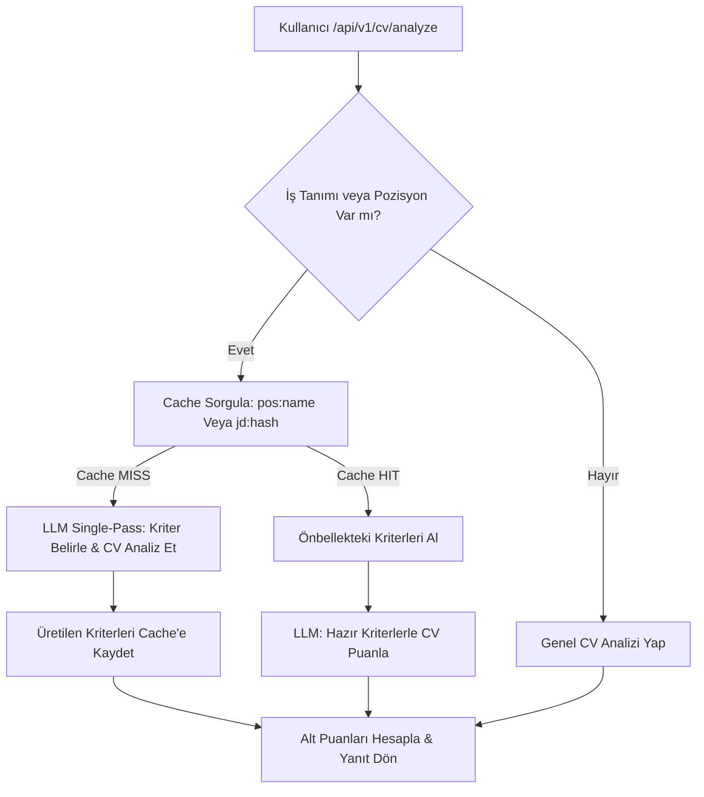

# AI Career Coach API

Otomatik CV analizi, ATS optimizasyonu ve gerçek zamanlı dinamik teknik mülakat simülasyonları yürüten, gücünü yerel yapay zekâ modellerinden (Ollama/Llama3) alan uçtan uca asenkron bir kariyer asistanı servisidir.

---

## 🛠️ Mimari ve Çözülen Problemler

Sistem tasarlanırken performans, kaynak yönetimi, hata toleransı ve tutarlı yapay zekâ çıktıları ana odak noktaları olmuştur. Aşağıda projede çözdüğümüz temel problemler, uyguladığımız çözümler ve alternatif yaklaşımlar detaylandırılmıştır:

### 1. Yüksek LLM Gecikmesi (Latency) & Çift Çağrı Problemi
* **Sorun:** İlk tasarımda LLM'e ardışık iki istek atılıyordu: Birinci istekte pozisyona uygun kriterler belirleniyor, ikinci istekte ise CV bu kriterlere göre parse edilip puanlanıyordu. Bu durum toplam API yanıt süresini 2 katına çıkarıyor ve kullanıcı deneyimini olumsuz etkiliyordu.
* **Uygulanan Çözüm (Single-Pass Prompt):** Hedef pozisyon (veya iş tanımı) ile CV metnini tek bir prompt şablonunda birleştirdik. LLM'in tek bir çağrıda hem gerekli kriterleri saptamasını hem de CV'yi bu kriterlere göre analiz ederek tek bir JSON nesnesi halinde dönmesini sağladık (`CV_SINGLE_PASS_SYSTEM_PROMPT`).
* **Alternatif Çözümler & Karşılaştırma:**
  * *Çağrıları Paralelleştirmek:* Kriter belirleme ve CV analizini paralel çalıştırmak bir seçenekti. Ancak, CV analizinin doğruluğu doğrudan belirlenen kriterlere bağlı olduğu için, kriterler oluşmadan CV'yi puanlamak mantıksal olarak mümkün olmamaktadır.
  * *İki Ayrı Küçük Model Kullanmak:* Kriter belirleme işini çok daha küçük/hızlı bir modele, analiz işini ise daha büyük bir modele yaptırarak paralel olmayan akışı hızlandırmak. Bu yöntem yerel kaynak tüketimini (GPU/RAM) aşırı artıracağı için yerel (local) çalışan bir projede tercih edilmemiştir.

### 2. Tekrarlı Pozisyonlar İçin Gereksiz LLM Çağrıları (Maliyet ve Performans)
* **Sorun:** Kullanıcılar sıklıkla benzer pozisyonlar ("Junior Frontend Developer", "Backend Developer" vb.) için CV yüklemektedir. Her istekte LLM'e sıfırdan kriter ürettirmek hem zaman kaybına hem de LLM sunucusunda gereksiz yüke sebep oluyordu.
* **Uygulanan Çözüm (Criteria Caching):**
  * Pozisyon isimlerini normalize ederek (`pos:junior_frontend_developer`) veya gönderilen özel iş tanımlarının SHA-256 hash değerlerini alarak (`jd:hash_kodu`) önbelleğe (Redis) kaydettik.
  * Aynı pozisyon tekrar sorgulandığında, sistem kriterleri önbellekten **0 milisaniye** gecikmeyle okur (`Cache HIT`) ve LLM'e sadece CV metnini bu hazır kriterlerle göndererek değerlendirmesini ister.
* **Alternatif Çözümler & Karşılaştırma:**
  * *Statik Kriter Tanımlamak:* Popüler pozisyonlar için kod içerisine statik kriter listesi yazmak. Bu yöntem esnekliği öldürür; sektördeki yeni teknolojiler veya kullanıcının girdiği özel iş ilanları (Job Description) bu statik listeyle değerlendirilemezdi.

### 3. Mülakat Simülasyonunda Oturum Durumu (State/Session) Eksikliği
* **Sorun:** `/interview/start` endpoint'inde kullanıcı mülakat yapmak istediği rolü (örn. React Developer) ve deneyim seviyesini seçiyordu. Ancak kullanıcı `/interview/respond` ile soruya cevap verdiğinde bu bilgiler kayboluyor ve sistem adayın cevabını her zaman sabit bir rol ("Software Engineer") üzerinden değerlendiriyordu.
* **Uygulanan Çözüm (Oturum Önbelleği):**
  * `/start` çağrıldığında sistem benzersiz bir UUID tabanlı `session_id` üretir ve kullanıcının seçtiği rol, deneyim seviyesi ve odak alanlarını cache'e kaydeder.
  * `/respond` çağrıldığında `session_id` üzerinden oturum detayları cache'ten dinamik olarak çekilir ve LLM değerlendirme prompt'una aktarılır.
* **Alternatif Çözümler & Karşılaştırma:**
  * *İstemci Tarafında Durum Saklama (Client-Side State):* Rol ve deneyim bilgilerini istemcinin (Frontend) her istekte tekrar göndermesini istemek. Bu yöntem güvenlik açıklarına (kullanıcının mülakat ortasında rolü manipüle edebilmesi) ve kirli bir API tasarımına yol açar.
  * *İlişkisel Veritabanı (PostgreSQL/MySQL):* Oturum durumlarını disk tabanlı bir veritabanında saklamak. Üretim ortamı için en güvenli yoldur ancak sadece anlık oturum durumunu saklamak için Redis bellek içi erişim hızı (low-latency) açısından çok daha uygundur.

### 4. Redis Bağlantı Kesintilerinde Sistem Tıkanması (Circuit Breaker)
* **Sorun:** Local geliştirme yaparken veya Redis sunucusunda kesinti yaşandığında, her API isteğinde Redis'e bağlanmaya çalışmak ve bağlantı zaman aşımını (timeout) beklemek API'yi tamamen yavaşlatıyor ve çalışamaz hale getiriyordu.
* **Uygulanan Çözüm (Throttled Ping / Circuit Breaker):**
  * `CacheService` içerisine zaman tabanlı bir cooldown (60 saniye) mekanizması eklendi.
  * Redis bağlantısı koptuğu anda sistem bunu algılar, hata kaydı bırakır ve sonraki 60 saniye boyunca Redis'e hiç istek atmadan doğrudan in-memory (RAM) önbelleği kullanır. 60 saniye geçtikten sonra arka planda tek bir ping atılarak Redis'in geri gelip gelmediği kontrol edilir.
* **Alternatif Çözümler & Karşılaştırma:**
  * *Doğrudan Catch ve Devam Et:* Her istekte try-catch bloklarıyla Redis'e bağlanmayı deneyip hata durumunda in-memory'e düşmek. Bu yöntem, her istekte Redis bağlantı kütüphanesinin timeout süresi kadar (örn. 2-5 saniye) tüm API çağrısını bloke ederdi.

### 5. LLM JSON Çıktı Tutarsızlıkları
* **Sorun:** Ollama'ya JSON formatı verilse bile, bazen yerel modeller çıktıları markdown kod blokları (```json ... ```) içine sararak döner. Bu durum doğrudan `json.loads` yapıldığında parse hatalarına sebep olur.
* **Uygulanan Çözüm (Robust JSON Extractor):**
  * LLM'den gelen metin temizlenirken başında ve sonunda bulunabilecek markdown kod çitleri (code fences) regex/string manipülasyonuyla ayıklanır, ardından temiz JSON parse edilir.

---

## 📈 Sistem Akış Şeması



---

## 📂 Proje Yapısı

```text
AI-CareerCoach/
│
├── app/
│   ├── api/
│   │   ├── endpoints/
│   │   │   ├── cv.py             # CV analiz endpoint'i (Caching & Single-Pass)
│   │   │   └── interview.py      # Mülakat simülasyonu endpoint'leri (Session State)
│   │   └── router.py             # API rotalarının birleştirilmesi
│   │
│   ├── core/
│   │   └── config.py             # Redis ve LLM yapılandırma ayarları
│   │
│   ├── services/
│   │   ├── cache.py              # Circuit breaker destekli asenkron Cache Servisi
│   │   ├── cv_analiz.py          # Alt puan kırılımı ve kurallı değerlendirme motoru
│   │   ├── pdf_parser.py         # PDF dosyalarından metin çıkarma servisi
│   │   └── llm/
│   │       ├── client.py         # Robust JSON destekli asenkron Ollama İstemcisi
│   │       └── prompts.py        # Single-pass ve değerlendirme prompt şablonları
│   │
│   └── main.py                   # FastAPI uygulaması başlangıç noktası
│
├── requirements.txt              # Proje bağımlılıkları (redis, fastapi, pypdf vb.)
├── docker-compose.yml            # FastAPI ve Redis servislerinin docker yapılandırması
└── Dockerfile                    # Python web servis imajı yapılandırması
```

---

## 🚀 Kurulum ve Çalıştırma

### 1. Docker ile Hızlı Kurulum (Tavsiye Edilen)
Projenin çalışması için arka planda bir Redis veritabanına ihtiyaç vardır. Docker Compose ile hem Redis'i hem de API'yi tek bir komutla ayağa kaldırabilirsiniz:

```bash
docker-compose up --build
```
FastAPI uygulaması `http://localhost:8000` portundan hizmet vermeye başlayacaktır. API dokümantasyonuna `http://localhost:8000/docs` adresinden erişebilirsiniz.

### 2. Yerel Ortamda Çalıştırma (Lokal)
Docker kullanmak istemiyorsanız, yerel olarak bir Redis sunucusu kurup çalıştırdıktan sonra aşağıdaki adımları izleyebilirsiniz:

1. **Sanal Ortam Oluşturun ve Aktifleştirin:**
   ```bash
   python3 -m venv venv
   source venv/bin/activate
   ```

2. **Bağımlılıkları Kurun:**
   ```bash
   pip install -r requirements.txt
   ```

3. **Uygulamayı Başlatın:**
   ```bash
   uvicorn app.main:app --reload
   ```

---

## 📡 API Uç Noktaları (Endpoints)

### 1. CV Analizi (`POST /api/v1/cv/analyze`)
Bu endpoint `multipart/form-data` biçiminde bir PDF dosyası alır ve isteğe bağlı hedef pozisyon ve iş tanımı parametrelerine göre CV'yi analiz eder.

* **Parametreler (Form-Data):**
  * `file`: CV PDF dosyası (Zorunlu)
  * `job_position`: Hedef pozisyon (Örn: "Junior Backend Developer") (İsteğe Bağlı)
  * `job_description`: İlanın iş tanımı metni (İsteğe Bağlı)

* **Örnek Yanıt:**
  ```json
  {
    "filename": "resume.pdf",
    "file_type": "application/pdf",
    "character_count": 1420,
    "parsed_skills": ["Python", "FastAPI", "SQL"],
    "suggested_improvements": ["Docker tecrübenizi projelerle örneklendirin."],
    "ats_score": 85,
    "final_score": 85,
    "score_breakdown": {
      "skill_score": 34,
      "keyword_score": 26,
      "formatting_score": 25
    },
    "score_summary": {
      "skill_count": 3,
      "llm_score": 85
    },
    "applied_criteria": [
      { "name": "Python Geliştirme", "weight": 0.4 },
      { "name": "API Tasarımı", "weight": 0.3 },
      { "name": "Veritabanı Yönetimi", "weight": 0.3 }
    ]
  }
  ```

### 2. Mülakatı Başlat (`POST /api/v1/interview/start`)
Mülakat simülasyonunu başlatır, parametreleri cache'e kaydeder ve ilk soruyu döner.

* **Girdi Şeması:**
  ```json
  {
    "role": "Frontend Developer",
    "experience_level": "Junior",
    "focus_areas": ["React", "CSS"]
  }
  ```

* **Örnek Yanıt:**
  ```json
  {
    "session_id": "session_bb444ecc-d4e4-4a59-93d2-2d950f9475a5",
    "role": "Frontend Developer",
    "first_question": "React'te state ve props arasındaki farkı açıklayabilir misiniz?"
  }
  ```

### 3. Cevap Gönder (`POST /api/v1/interview/respond`)
Mülakat sorusuna verilen yanıtı gönderir, arka planda cacheden oturum bilgilerini çeker ve LLM değerlendirmesini alır.

* **Girdi Şeması:**
  ```json
  {
    "session_id": "session_bb444ecc-d4e4-4a59-93d2-2d950f9475a5",
    "question": "React'te state ve props arasındaki farkı açıklayabilir misiniz?",
    "answer": "Props dışarıdan gelen verilerdir, state ise bileşenin kendi iç durumudur."
  }
  ```

* **Örnek Yanıt:**
  ```json
  {
    "feedback": "Bileşenin iç durumu ve dış veri farkını doğru belirttiniz. Props'un değiştirilemez (read-only) olduğunu belirtmek cevabınızı daha da güçlendirebilirdi.",
    "score": 8,
    "next_question": "Peki, bir bileşenin durumunun değişmesi React'te neyi tetikler?"
  }
  ```
